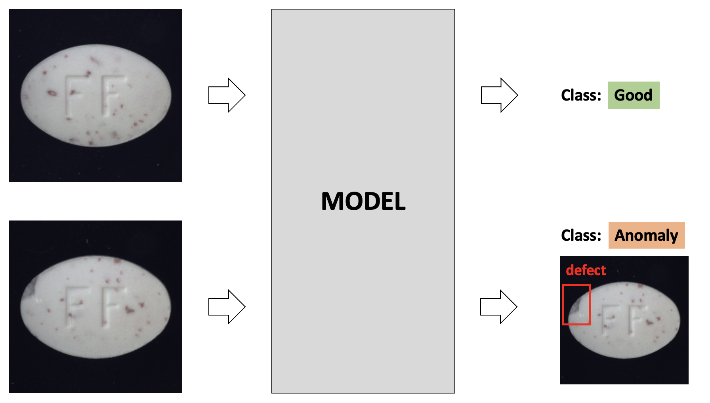
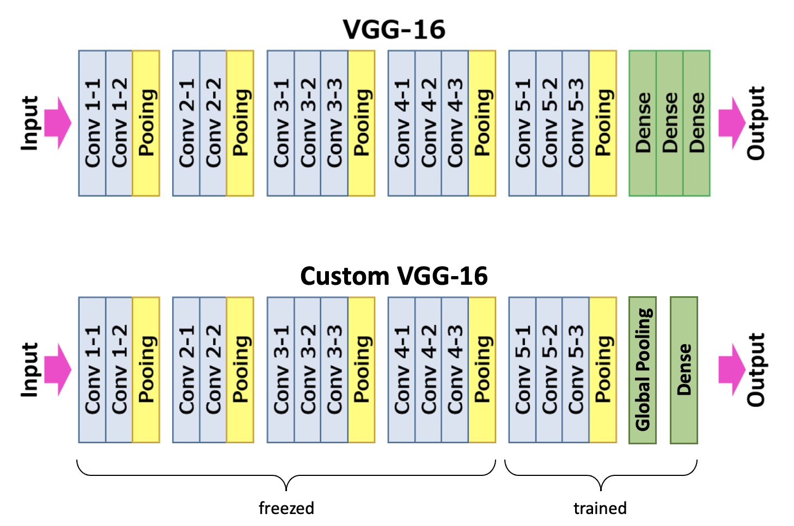
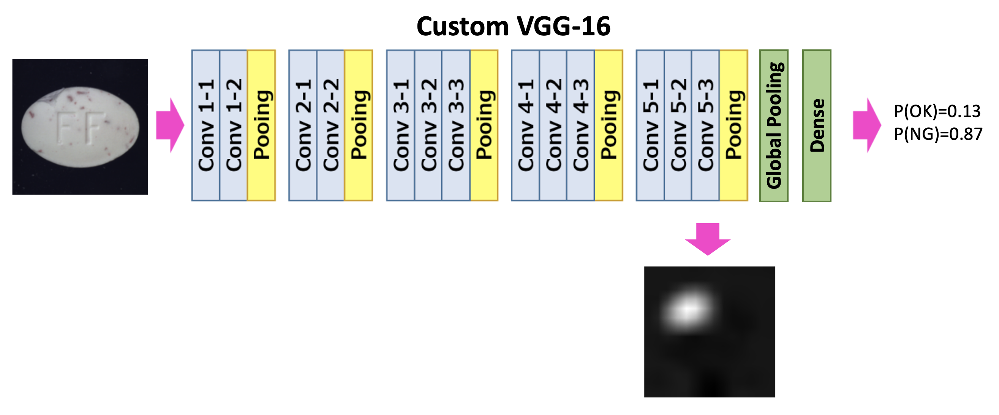
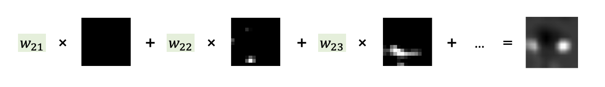
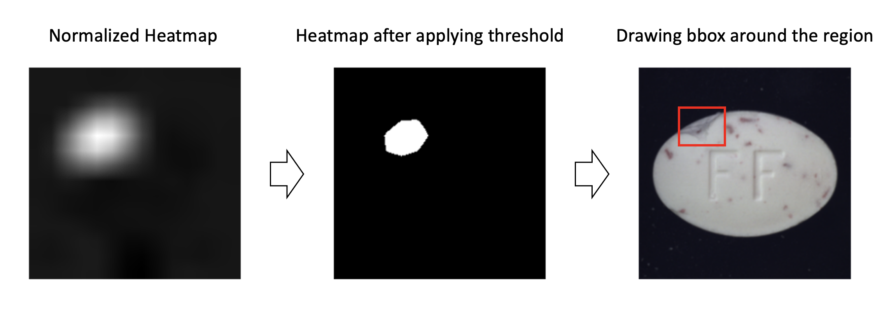
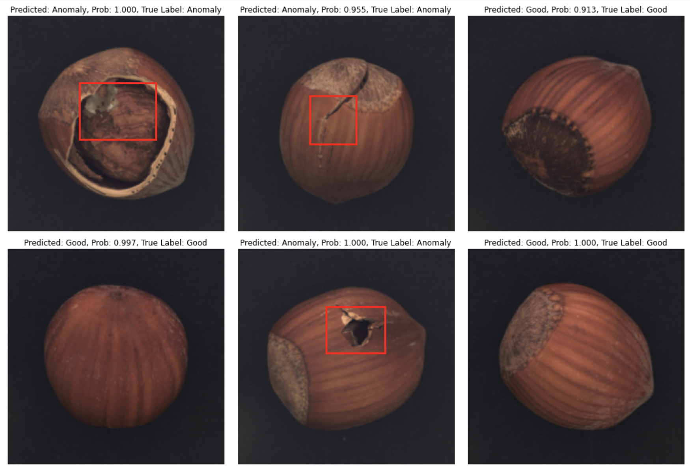
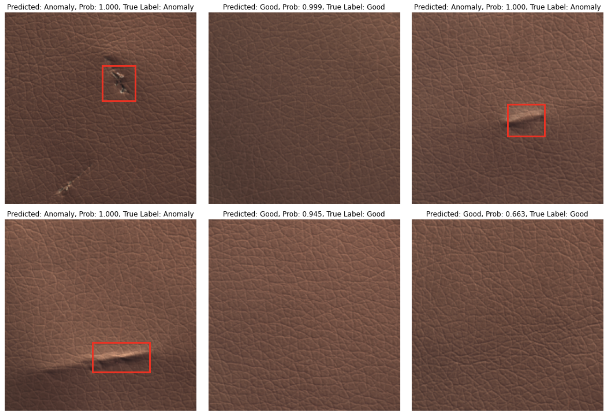
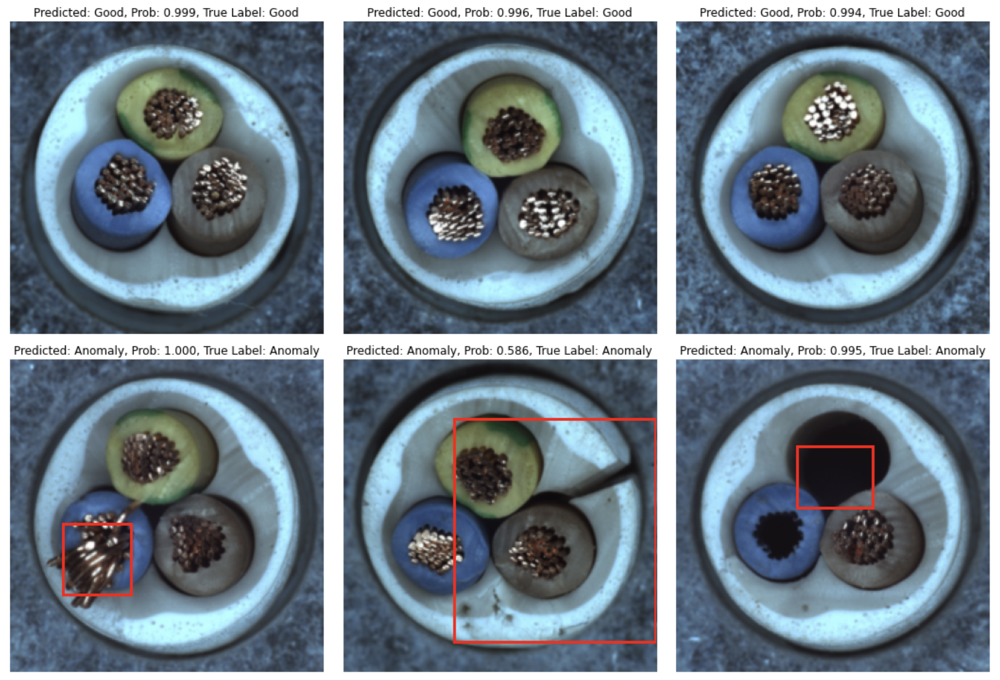
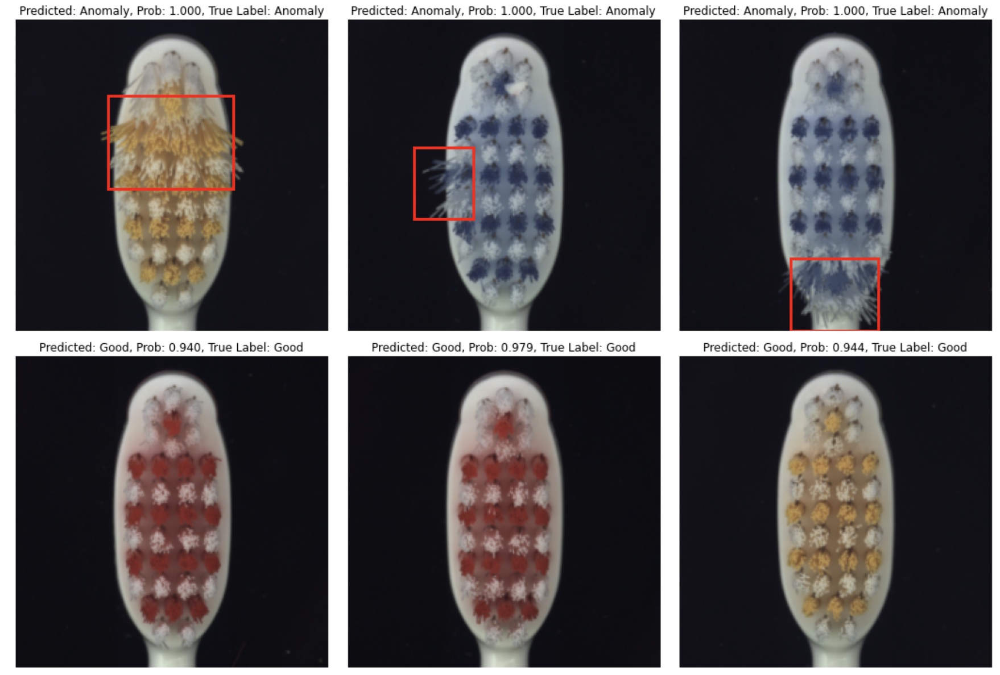
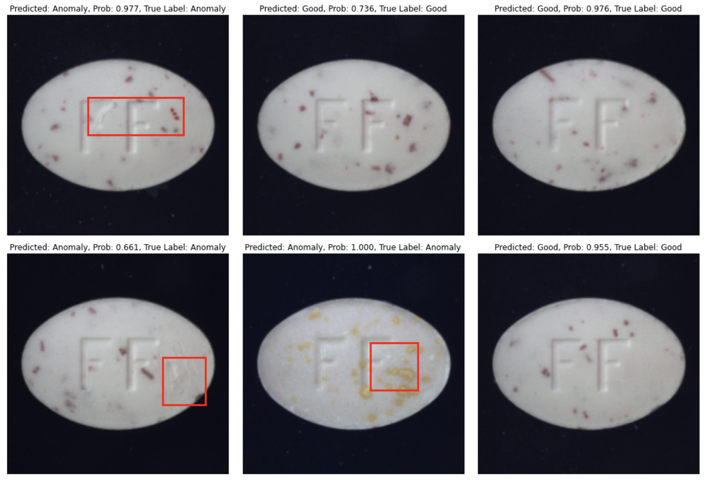

# Visual-Inspection


PyTorch Pipeline to train a model that classifies images as 'Good' / 'Anomaly'. Trained without any labels for defective regions, model in the inference mode is able to predict a bounding box for a defective region in the image. This is achieved by processing feature maps of the deep convolutional layers. For more details, check my post [Explainable Defect Detection using Convolutional Neural Networks: Case Study](https://towardsdatascience.com/explainable-defect-detection-using-convolutional-neural-networks-case-study-284e57337b59).

*Model predicts class 'Good' / 'Anomaly' and localizes a defect region for an 'Anomaly' class:*



## Architecture

**Training.**
VGG16 feature extractor pre-trained on ImageNet, classification head - Average Global Pooling and a Dense layer. Model outputs 2-dimensional vector that contains probabilities for class 'Good' and class 'Anomaly'. Finetuned only last 3 convolutional layers and a dense layer. Loss is Cross-Entropy; optimizer is Adam with a learning rate of 0.0001.


*Model Training Pipeline:*


**Inference.**
During inference model outputs probabilities as well as the heatmap. Heatmap is the linear combination of feature maps from layer conv5-3 weighted by weights of the last dense layer, and upsampled to match image size. From the dense layer, we take only weights that were used to calculate the score for class 'defective'. 

For each input image, model returns a single heatmap. High values in the heatmap correspond to pixels that are very important for a model to decide that this particular image is defective. This means, that high values in the heatmap show the actual location of the defect. Heatmaps are processed further to return bounding boxes of the areas with defects.

*Model Inference Pipeline:*


*Detailed architecture of the model classification head:*


*The final heatmap is calculated as the sum of Conv5-3 layer heatmaps each multiplied by the weight in the Dense layer that affected 'Anomaly' class score:*


*How to process heatmap into the bounding box:*



## Data

 - Dataset used - [MVTEC Anomaly Detection Dataset](https://www.mvtec.com/company/research/datasets/mvtec-ad). Thid dataset is released under the [Creative Commons Attribution-NonCommercial-ShareAlike 4.0 International](https://creativecommons.org/licenses/by-nc-sa/4.0/) License (CC BY-NC-SA 4.0), which means it is not allowed to use it for commertial purposes.
 - Images resized to 224x224.
 - Train/Test split - 80/20 in stratified manner by defect types.


## Evaluation
Evaluation was performed on 5 subsets from the MVTEC Anomaly Detection Dataset - Hazelnut, Leather, Cable, Toothbrush, and Pill. A separate model was trained for each subset. Class weighing in loss function - 1 for 'Good' class and 3 for 'Anomaly'. The model was trained for at most 10 epochs with early stopping if train set accuracy reaches 98%.

**Results**


| Subset Name | N Images <br /> (Train / Test) | Test Set <br /> Accuracy | Test Set <br /> Balanced Accuracy | Test Set <br /> Confusion Matrix |
| --- | --- | --- | --- | --- |
| Hazelnut | 401 / 100 | 97.0% | 95.3% | TP=85, FN=2, <br /> FP=1, TN=13 |
| Leather | 295 / 74 | 96.0% | 92.1% | TP=55, FN=0, <br /> FP=3, TN=16 |
| Cable | 299 / 75 | 94.7% | 88.9% | TP=57, FN=0, <br /> FP=4, TN=14 |
| Toothbrush | 82 / 20 | 90.5% | 83.3% | TP=15, FN=0, <br /> FP=2, TN=4 |
| Pill | 347 / 87 | 82.8% | 81.7% | TP=50, FN=9, <br /> FP=6, TN=22 |

<br><br>
*Hazelnut: Prediction on Test Set*


*Leather: Prediction on Test Set*


*Cable: Prediction on Test Set*


*Toothbrush: Prediction on Test Set*


*Pill: Prediction on Test Set*



## Project Structure

- ```Training.ipynb``` - notebook with training, evaluation and visualization
- ```utils/model.py``` - file with model class 
- ```utils/dataloder.py``` - file with dataloader
- ```utils/helper.py``` - other functions used in the project
- ```utils/constants.py``` - constants used in the project
- ```weights/``` - folder with trained models


## References

Zhou, Bolei, Aditya Khosla, Agata Lapedriza, Aude Oliva, and Antonio Torralba: Learning deep features for discriminative localization; in: Proceedings of the IEEE conference on computer vision and pattern recognition, 2016. [pdf](https://arxiv.org/pdf/1512.04150.pdf)

Paul Bergmann, Kilian Batzner, Michael Fauser, David Sattlegger, Carsten Steger: The MVTec Anomaly Detection Dataset: A Comprehensive Real-World Dataset for Unsupervised Anomaly Detection; in: International Journal of Computer Vision, January 2021. [pdf](https://link.springer.com/content/pdf/10.1007/s11263-020-01400-4.pdf)

Paul Bergmann, Michael Fauser, David Sattlegger, Carsten Steger: MVTec AD – A Comprehensive Real-World Dataset for Unsupervised Anomaly Detection;
in: IEEE Conference on Computer Vision and Pattern Recognition (CVPR), June 2019. [pdf](https://www.mvtec.com/fileadmin/Redaktion/mvtec.com/company/research/datasets/mvtec_ad.pdf)


## License
This project is licensed under the terms of the [MIT license](https://choosealicense.com/licenses/mit/).
